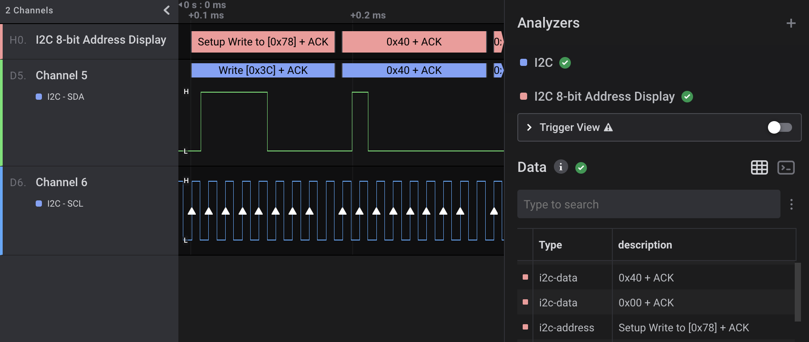

# I2C 8-bit Address Display

This HLA is a simple utility for viewing 7 bit I2C addresses as the 8-bit value that appears on the bus. This is useful when debugging microcontroller firmware that does not natively support 7-bit I2C address.

Because the Saleae I2C decoder always displays and stores I2C addresses as a 7 bit number, this extension left shifts the address by 1 and sets the LSB for read transactions.

